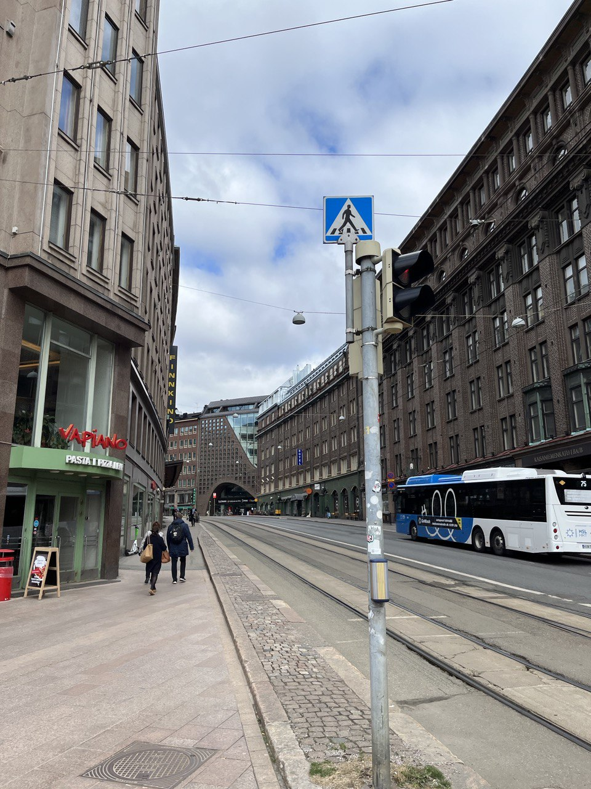
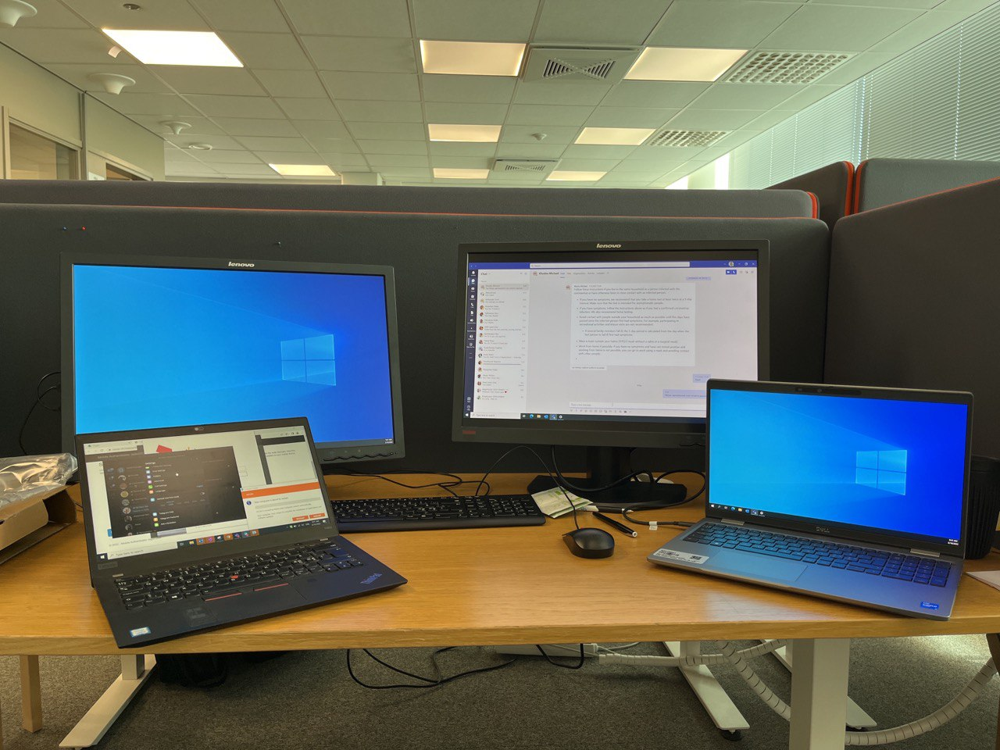
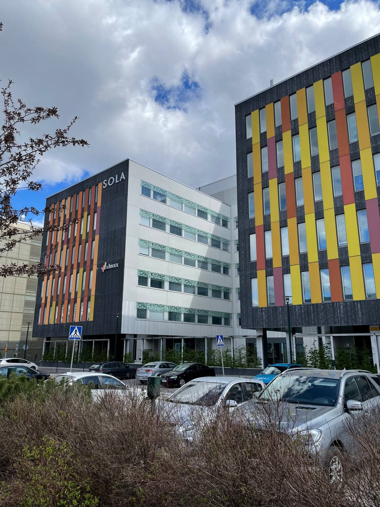
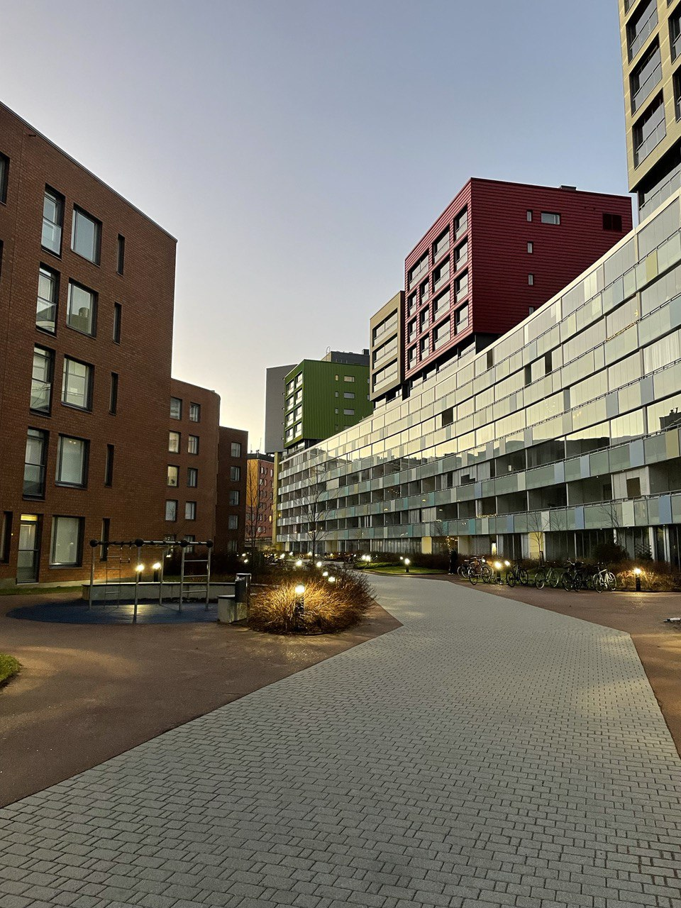
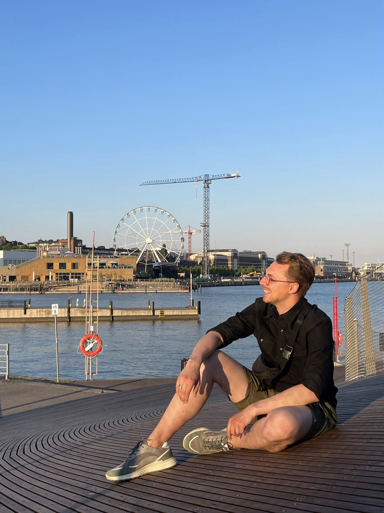
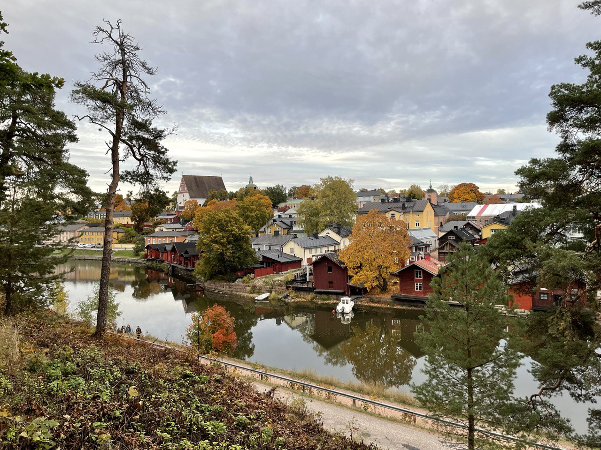

# Как я остался без работы из-за войны, но сумел релоцироваться и увезти партнёра в Финляндию

Тестировщик Влад уехал в Финляндию через два месяца после начала войны. Вот его история:

Меня зовут Влад, 8 мая я уехал из Санкт-Петербурга в Финляндию, живу на границе городов Хельсинки и Эспоо. На работе у меня интересная позиция — тестировщик/скрам-мастер в компании SD Worx, это крупнейший в Европе HR и Payroll провайдер.

_[твиттер](https://twitter.com/_volkovitskiy?s=21&t=kQfQsGOUMapczWUlyEMENQ) Влада_

## Компания уволила меня, чтобы релоцировать 

До этого я работал в Санкт-Петербурге в компании «Аркадия». Это аутсорс, немаленькая часть которого работала на финский/шведский энтерпрайз. Но 25 февраля с нами разорвали контракт, потому что в головном офисе в Бельгии были не в восторге от идеи перечислять деньги в Россию. В начале марта нам предложили перевести всех сотрудников в компанию SD Worx. В марте был запущен процесс подготовки, который занял два месяца. Мы ждали получение вида на жительство, я получил его один из первых.

После увольнения из «Аркадии» нам ещё месяц платили обычную зарплату, хотя работать мы ещё не начали. Нас предупредили, что мы сидим на бенче и ждём проект. Финский энтерпрайз не обрадовался, что мы перестали с ним сотрудничать, потому что россияне составляли почти всю их команду разработки. Когда выяснилось, что мы все уезжаем, компания заставила нас написать заявление на увольнение. С конца марта я перестал получать зарплату и до переезда в Финляндию жил на накопления. Нам согласились выплатить релокационный бонус, только когда мы приедем.

## Оформить документы было легко

В Финляндии есть ВНЖ для специалистов, получить который довольно легко. Нужно лишь соблюсти ряд требований: минимальная зарплата от 3000 евро, высшее образование. Вся наша компания подходила под эти условия. Пакет документов включал паспорт, контракт с работодателем и диплом или подтверждённый опыт работы в соответствующей сфере от двух лет. Взнос в размере почти 500 евро за нас платил работодатель. Уже через месяц после подачи документов мы получили положительное решение по ВНЖ.

Некоторые из моих коллег поехали работать в Швецию. Процесс их релокации был очень похож, но отнял больше времени, а взнос за рассмотрение заявки на ВНЖ был выше.

Почти все мои друзья тоже уезжали из Петербурга. Когда я собирал свои вещи, понял, что перевезу столько, сколько смогу взять с собой за один раз. Поезда Allegro, соединяющие Петербург и Хельсинки, закрыли примерно за месяц до нашего переезда. Остался единственный вариант — ехать на автобусе, потому что своей машины у меня нет. Из-за этого уезжать пришлось налегке, я взял только самую базовую одежду. Всё остальное пришлось покупать на месте. Я переезжал один, но спустя время мне удалось перевезти и своего партнёра.

## Я с детства знал, что уеду из России, но не думал, что при таких обстоятельствах

За семь лет, что я прожил в Петербурге, я очень привязался к этому городу. Безумно скучаю по какой-то движухе, потому что Финляндия — не самая богатая на тусовки, рестораны и прочий досуг страна. Индустрия развлечений здесь другого уровня, людей меньше и они более семейные. Поэтому большинство активностей здесь соответствующие.

Мне сложно сказать, как переезд проходил с психологической точки зрения. Пытаюсь сформулировать ответ для себя уже не первый месяц. Я как будто знал, что уеду, с детства. Даже родители меня к этому подталкивали, готовили морально. Я не жалею, что уехал, всё сложилось так, как я хотел, просто не в самых приятных обстоятельствах. Конечно, мне многого здесь не хватает. В первую очередь — друзей, несмотря на то, что я переехал с большим количеством коллег. Большая часть моего круга общения разъехалась в разные страны, причём не в Европу, поэтому увидеться нам будет непросто.

## Мой партнёр выезжал через разрешение консула

У моего партнёра не было Шенгена. Когда понадобилось уехать, Финляндия ещё не открыла выдачу туристических виз, поэтому мы решили, что он подаст документы на основании близких отношений со мной. Для этого пришлось собрать множество бумаг: документы с работы, выписки со счетов, сведения о зарплате с момента переезда. Мы оба писали письма, прикладывали совместные фото и скриншоты нашей переписки. Его вызывали к консулу, чтобы дать возможность предоставить доказательства. У нас не было общего договора на аренду квартиры, поэтому всё было под вопросом. Но в результате ему дали визу на полгода.

Мы уезжали через Эстонию. Пришлось бронировать проживание в эстонском SPA-отеле, потому что тогда нельзя было выехать из России без такого основания, как, например, лечение. Заявление на визу он подал в начале июня, в середине июля был здесь, а в сентябре мы поженились. Уже в октябре он получил ВНЖ. Нам говорили, что потребуется ждать около 9 месяцев, но ему дали ВНЖ за 10 дней.

## В Финляндии я чувствую себя в безопасности

В Финляндии мне нравится безопасность и тотальное чувство спокойствия. Я чувствую желание помочь всем вокруг в любых вопросах. У меня очень поддерживающий начальник, он за нас переживает. Когда началась мобилизация, он узнавал у своей жены, которая работает в миграционной службе, не собираются ли депортировать русских. Большинство людей здесь такие, это здорово, потому что, по моему опыту, в России всё сложнее, приходится больше надеяться на себя.

Конечно, здесь другой уровень заработка. На некоторых вещах я начал экономить. Например, не могу себе позволить каждый день есть вне дома, как в Петербурге. Не могу еженедельно ходить в бары, но при этом за четыре месяца я полностью обставил квартиру мебелью и техникой. В России за такой срок я не смог бы это сделать.

Мне нравится возможность быстро и за небольшие деньги отправиться в любую европейскую страну. Я успел попутешествовать, когда жил в России. Но потом всё время отнимала работа и учёба, а потом и вовсе началась война. Я подумал, что на этом всё, больше в жизни путешествий не предвидится. К счастью, это оказалось не так.

## Эмигрировать в одиночку — безумно тяжело 

Я считаю, что, если есть возможность, надо уезжать не одному, потому что это оказалось безумно тяжело. Наша команда насчитывает пятьдесят человек, но я общаюсь примерно с восемью из них. Этот дефицит общения привёл к тому, что после переезда, как только спало первое чувство эйфории, меня накрыла депрессия. Парням в Россию возвращаться как минимум опасно, поэтому лучше уехать с кем-то, с кем не будет одиноко. Несмотря на поддерживающую обстановку в Финляндии, надо общаться с теми, кто проживает похожий опыт.

Очень многие мои знакомые уехали в Армению и Грузию. Это сделать проще, но не очень понятно, что у них со статусом. Пока они могут находиться там без визы. Если эта возможность исчезнет, то станет непонятно, что дальше делать. Поэтому по возможности, конечно, надо искать себе работу с релокацией. 

Я считаю, что мне повезло. Всё прошло просто и гладко. Конечно, мне так не казалось, когда я сидел в России на исходе второго месяца без работы, у меня заканчивались деньги и я не понимал, как всё сложится дальше. Но всё закончилось благополучно, за меня очень многое сделала компания. Пройдя всё то же самое с моим партнёром, я понял, что местная бюрократия в Финляндии не таит особых сложностей. При необходимости можно без проблем разобраться самому. Это возможно благодаря тому, что здесь все говорят на английском, и государственные услуги можно получить в том числе на нём. Я думаю, что в других странах с этим сложнее.

Мы с коллегами-релокантами уже учим финский язык. Компания, которая нас перевезла, наняла нам преподавателя. Обучение проходит плохо, финский язык не самый простой, но помогает желание его выучить. Знание финского понадобится, чтобы претендовать на получение гражданства. 

