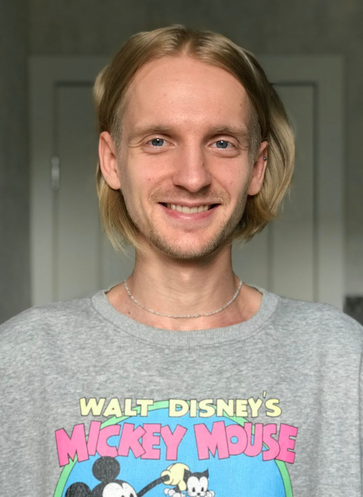

# Я был аспирантом в Политехе и работал поваром, а стал аналитиком в финтехе

Это история Егора, который окончил магистратуру на факультете радиофизики, работал поваром и не мог найти себя. А потом съездил на Камчатку, пересмотрел свою жизнь, выучился программированию и стал аналитиком в банке.

[@egor_herby](https://twitter.com/egor_herby)

Меня зовут Егор, я приехал в Питер из Оренбурга, закончил Питерский политех. Получил степень бакалавра и пошёл в магистратуру. Интересно, что, пока я учился, факультет радиофизики переименовали в факультет физики, нанотехнологий и телекоммуникаций. Но в последнее время слово «нанотехнологии» исчезло из названия. Видимо, нанотехнологии стали не нужны. Впрочем, их там и не было никогда. Просто во времена, когда только появился центр Сколково и всё это было очень модно, кто-то решил, что где микроконтроллеры, там и нанотехнологии. 

## Стал аспирантом и разочаровался в российской науке

После магистратуры я не знал, что делать, и поступил в аспирантуру. Аргумент был в том, что это позволяло отбиться от военкомата. А я всегда был пацифистом и никаким образом не хотел быть связан с армией. Можно сказать, я расплатился за долг Родине довольно бесполезно проведённым временем в университете. Могу сказать, что я остался разочарованным высшим образованием в России.

После того как я послушал лекции из MIT и Гарварда на площадках типа YouTube и Coursera, мне было тяжко ходить на лекции в университете. Наверное, это отчасти повлияло на то, что я разочаровался в своём образовании и не верил в себя.

Всё же я получил фундаментальные знания по физике и математике. Грубо говоря, могу понять, что написано на Википедии о той или иной технологии.

Что касается профильных знаний для работы в IT, ещё в школе я учил Pascal. Не могу сказать, что освоил его на серьёзном уровне, в олимпиадах не выигрывал. Что-то получалось, от чего-то мозги скрипели. У меня, как у многих, был такой одноклассник, которому всё давалось легче. У него программирование было будто вшито в кору головного мозга, он думал алгоритмами. Таким людям, кажется, не приходится напрягаться, им просто сразу в голову приходят решения. Вот этот одноклассник и побеждал в олимпиадах, а я чувствовал, что для развития в сфере IT мне не хватает IQ. В то время нам транслировали, что программирование — это сложная математика. Только после курса CS50 от Гарварда я почувствовал, что гением быть не обязательно, в программировании есть много всего помимо олимпиадных задач.

Но это случилось намного позже. А в первые годы освоения программирования я натолкнулся на Википедии на статью «[Коды Рида — Соломона](https://ru.wikipedia.org/wiki/%D0%9A%D0%BE%D0%B4_%D0%A0%D0%B8%D0%B4%D0%B0_%E2%80%94_%D0%A1%D0%BE%D0%BB%D0%BE%D0%BC%D0%BE%D0%BD%D0%B0#:~:text=%D0%9A%D0%BE%D0%B4%D1%8B%20%D0%A0%D0%B8%D0%B4%D0%B0%20%E2%80%94%20%D0%A1%D0%BE%D0%BB%D0%BE%D0%BC%D0%BE%D0%BD%D0%B0%20(%D0%B0%D0%BD%D0%B3%D0%BB.,%D1%80%D0%B0%D0%B1%D0%BE%D1%82%D0%B0%D1%8E%D1%89%D0%B8%D0%B5%20%D1%81%20%D0%B1%D0%B0%D0%B9%D1%82%D0%B0%D0%BC%D0%B8%20(%D0%BE%D0%BA%D1%82%D0%B5%D1%82%D0%B0%D0%BC%D0%B8).))». Я прочел её, ничего не понял и надолго уверился, что Computer Science вообще не для меня. Казалось, это какой-то другой мир, для которого я слишком тупой.

Поступив в университет, я делал инженерные, научные расчёты. Строил графики, писал мелкие программы. Пришлось немного освоить C, но у нас все в основном пользовались MatLab и Mathcad, а мне эти системы казались отстойными, и я захотел найти альтернативу. Тогда на глаза попалась Wolfram Mathematica, в обнимку с которой я потом и проучился все оставшиеся годы в университете. Всех друзей я агитировал переходить на неё.

Мне очень нравилась эта система, потому что она мультипарадигмальная, но в основе лежит функциональная парадигма. Поэтому всё построено на мэпах, аплаях, редюсах и так далее. Когда я позже встречался с этими понятиями, например, изучая Python, они меня не отпугивали. Наоборот, казалось, что это очень удобно и классно.

Даже после знакомства с Python я не двигался в правильном направлении. Задним числом я понимаю, что мог бы приложить ещё немного усилий и быть в шоколаде. Но я всегда бросал начатое, потому что не был в себе достаточно уверен. Как я сейчас понимаю, это был самосаботаж. На самом деле, если немного проявить упорство и не опускать руки, когда сталкиваешься с неудачами, всё получится быстрее.

## Параллельно с аспирантурой работал поваром

Поступление в аспирантуру было простым и закономерным шагом. Там от меня ничего не требовалось, я никому не был нужен. В первом семестре даже платили стипендию. Но потом я взял и пошёл работать в ресторан, потому что мне всегда нравилось готовить. Это был единственный навык, на который я делал ставку в то время, потому что считал себя недостаточно умным для интеллектуального труда. Я до сих пор считаю, что в России высшее образование и даже красный диплом в большинстве вузов ничего не значат в профессии, потому что для этого не требуется хоть сколько-то высокий уровень интеллекта и стараний.

Я захотел разобраться, как правильно обращаться с тестом, и научиться готовить правильную пиццу. Устроился работать в ресторан, где была настоящая «правильная» дровяная печь, собранная потомственным мастером из Италии. Я проработал там полгода, было весело, но работать на кухне — это очень тяжёлый труд. Было трудно работать по 12-14 часов в день. Практически везде трудоустраивают «в чёрную». Если заболеешь, кому-то придётся тебя заменять, потом ты будешь вынужден работать много дней подряд. От тебя постоянно пахнет едой, могут появиться проблемы с ногами или спиной от стоячей работы. Ты не всегда успеваешь сходить в туалет или поесть. Единственное, чему я по-настоящему научился, это работать быстро. Особых навыков я не получил, потому что и так многое знал и умел.

Пока я работал в ресторане, мой университетский друг пошёл в EPAM на бесплатные курсы по Java-разработке с возможным трудоустройством. Потом превратился в скалиста, сейчас переехал на Кипр.

Я наслушался его рассказов и решил пойти в EPAM на курсы по фронтенду. Они длились около трёх месяцев, я ходил в офис компании на занятия, делал домашние задания. Но, так как я занимался самосаботажем и был в точке, где дедлайны меня уже не заставляли шевелиться, я дотянул выполнение финального проекта до самого последнего срока и в итоге завалил его. Меня не взяли к ним на стажировку. 

## Волонтёрил в лагере на Камчатке и пошёл в терапию

С этим пора было заканчивать. Мне подвернулся вариант волонтёрства в сёрф-лагере на Камчатке. Я потратил накопления на путешествие туда, на берег Тихого океана. Это было одно из лучших решений в жизни, точно лучше, чем решение учиться в магистратуре. Два месяца я был поваром в сёрф-лагере. Начал понемногу кататься на сёрфе, познакомился с кучей классных ребят. 

Вернувшись в Питер, я открыл для себя большое сёрф-комьюнити. Люди катаются на Ладожском озере, в Финском заливе. Они постоянно мониторят ветер, чтобы дождаться нужного направления и поехать «на прогноз». Я познакомился с парнем, который горит сёрфингом и делает доски прямо в своей квартире. Он мой ровесник, но он стал моим учителем сёрфинга и другом. В следующие два года я ездил в тот же лагерь на всё лето.

Но всё же после первого возвращения с Камчатки я свалился с настоящей депрессией. Столкнулся с дереализацией, почти не ел и плохо спал. Осознав, что что-то надо менять, я прошёл терапию, что тоже считаю одним из лучших решений в жизни. Всё это — шаги, которые позволили мне прийти в ту точку, где я сейчас нахожусь.

## Бросил аспирантуру и пошёл учиться

Разобравшись в себе, я бросил аспирантуру. На полгода основательно погрузился в обучение. Я начал проходить курсы на Stepik, смотреть больше лекций на YouTube, читать всевозможные статьи.

Больше всего мне помогло обучение в школе The Rolling Scopes. Это бесплатно, я прошёл вводный курс по machine learning, который делали какие-то выходцы из EPAM. Учёба длилась три месяца, были жёсткие дедлайны. Нужно было делать задания каждые две недели, иначе не начислят баллы и не выдадут сертификат. Я серьёзно к этому подошёл, много занимался. Посреди курса у меня сломался основной ноутбук, и пришлось работать на машине, найденной в шкафу. Ноут был настолько медленный, что подсветка синтаксиса в IDE не поспевала за тем, как я пишу. Это было мучение, но я всё доделал.

На курсе я многому научился, хотя, честно сказать, пока не пользуюсь всем этим на работе.  

Всё равно я был рад получить сертификат об окончании этого курса, в отличие от золотой медали и красного диплома. Потому что из 1000 участников до конца дошло меньшинство, а я оказался в числе сотни самых успешных студентов. Особенно странно было узнать, что со мной учились люди, которые уже работают инженерами по машинному обучению. Не знаю, зачем им вводный курс, может, чтобы что-то доказать себе или получить «корочку»?

Было здорово наконец-то справиться со своей прокрастинацией и доказать себе, что я всё это могу. Закончив с ML, я захотел подтянуть свои знания по SQL, потому что это много где может пригодиться. Я прошёл пару-тройку курсов по SQL. Один из них — вообще какой-то чудесный. Это Интерактивный тренажёр по SQL на платформе Stepik.

## Устроился аналитиком в Тинькофф-банк

Работу я искал достаточно долго, два или три месяца. В первую очередь присматривался к вакансиям на hh.ru, но и прокачивал профиль на LinkedIn. Например, хорошо помогло добавить всех людей, с которыми я учился на курсах по программированию. Так я расширил сеть контактов, стало проще добавляться к нужным людям. Кому-то я писал в личку. Но ребята, которые уже работали аналитиками, к примеру, в «Магните» или X5 Retail Group, говорили, что в этих компаниях уже остановлен набор. Это как раз был худший период за всё время с февраля 2022 года. Найм приостановился, вакансии были, но на них не собирались брать джунов или стажёров. Я регулярно откликался на вакансии, надеясь найти работу аналитиком и не возвращаться поваром на кухню.

В какой-то момент со мной связалась HR из Тинькофф. Она задала мне какие-то вопросы и назначила следующий этап интервью. Но потом мне перезвонили и сказали, что что-то не так с вакансией, процесс найма сорвался. Обещали выйти на связь, если что-то появится. Я подумал, что это обычная вежливость — деликатная форма «послать» кандидата. Но через месяц рекрутерка действительно перезвонила мне и предложила попробоваться на новую вакансию. Сказать, что я был в шоке — ничего не сказать.

Я выполнил тестовое задание и прошёл пару раундов интервью. Не было сложных собеседований вроде whiteboard и прочего, скорее, мы просто общались. Со стороны работодателя были приятные ребята, все этапы заняли месяц. Я вышел на работу в середине августа, и сейчас мой испытательный срок как раз подошёл к концу.

Сейчас я работаю в Тинькофф-банке и сам не верю, что всё так удачно сложилось. Мне здесь нравится, учитывая, что это моя первая «взрослая» работа — с налогами и всем таким. Я занимаюсь операционной аналитикой. Анализирую все данные их колл-центра, связанные с одним банковским продуктом. Считаю все метрики, делаю прогнозирование, считаю количество операторов, которые понадобятся в следующем месяце. Мне прислали ноут и второй монитор, я работаю удалённо, чувствую нормальное отношение к себе. Сколько-то часов в неделю выделено специально под обучение. После работы в ресторане это очень ценное место, где тебя никто не мучает зря, дают спокойно разбираться, можно работать в своём темпе. Пока больше всего мне, как младшему аналитику, понадобилось сложение и умножение, многие меня поймут, потому что тоже сталкивались с этим.

Во время поиска работы и в процессе собеседований мне снова было плохо — как и многим людям с депрессией и тревожностью после февраля 2022 года. Чтобы как-то занять свой больной ум, я вырастил закваску и начал печь хлеб. Мне это сильно помогло. Может быть, когда я заработаю денег в IT, открою свою пекарню с artisan хлебом и specialty кофе. В любом случае хобби — это важно.

